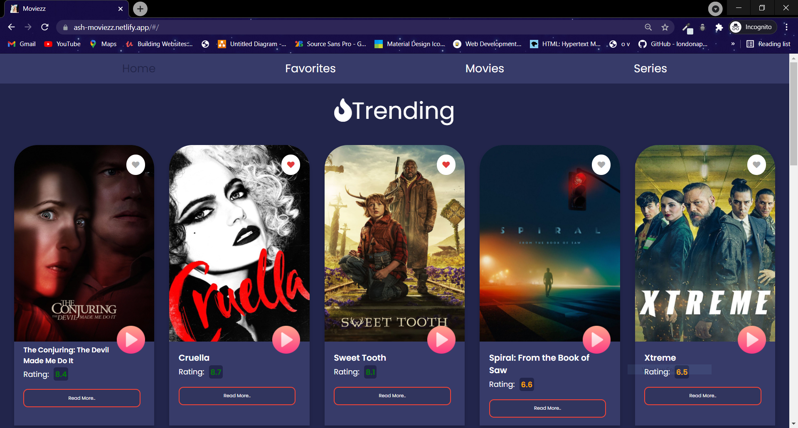

# Moviezz

> A simple movies recommendation app created using React , Firebase , react-router-dom   > [Live Demo](https://ash-moviezz.netlify.app/)

## Table of contents

- [General info](#general-info)
- [Screenshots](#screenshots)
- [Technologies](#technologies)
- [Setup](#setup)
- [Features](#features)
- [Status](#status)

## General info

The project is simple movies recommendation app created using react. For backend Firebase is used. The app also have bookmarked movies section so that user can save movies for later. Each movie has a separate details section. Implemented using dynamic routing using react-router-dom. A search bar is also introduced so that user can search for their favourite movies.

## Screenshots

Home Page

Favourites Page

Detailed Movies Page

Only Movies

Only Series

## Technologies

- React - version 17.0.2
- react-router - version 5.0.2
- Firebase - version 8.5.0
- Material UI - version 16.8.0

## Setup

In the project directory, first install all the dependenices run:

## `npm install`

To start the project in the project directory run:

## `npm start`

## Features

List of features ready and TODOs for future development

- Bookmark Section
- Detail Page for each movie

To-do list:

- Availiblity on different streaming flatform

## Status

Project is : _in progess_
